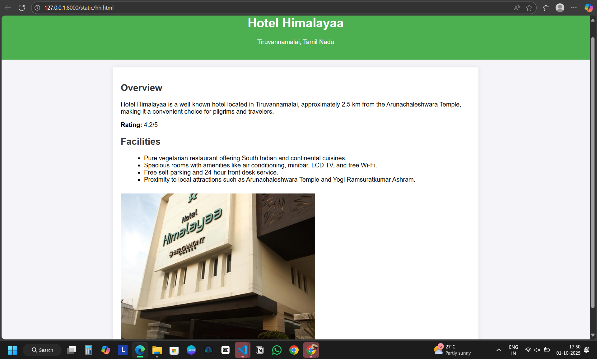
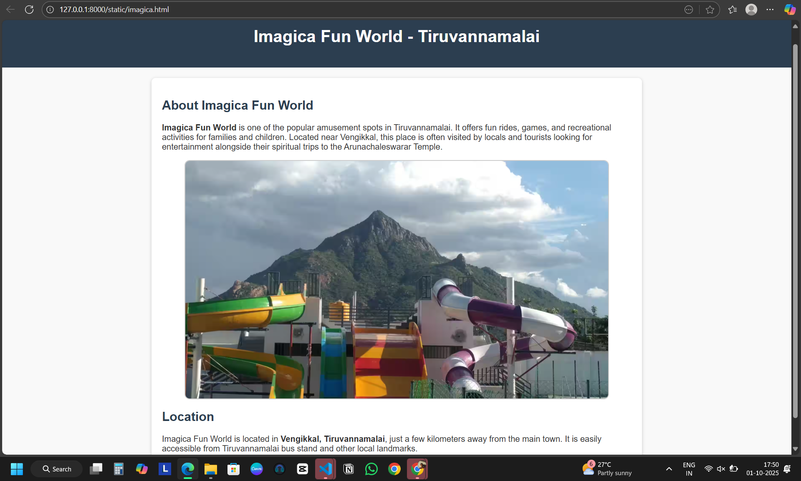
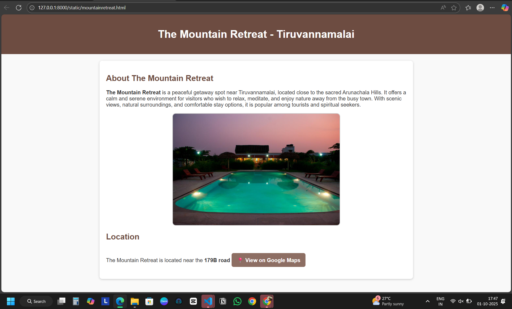
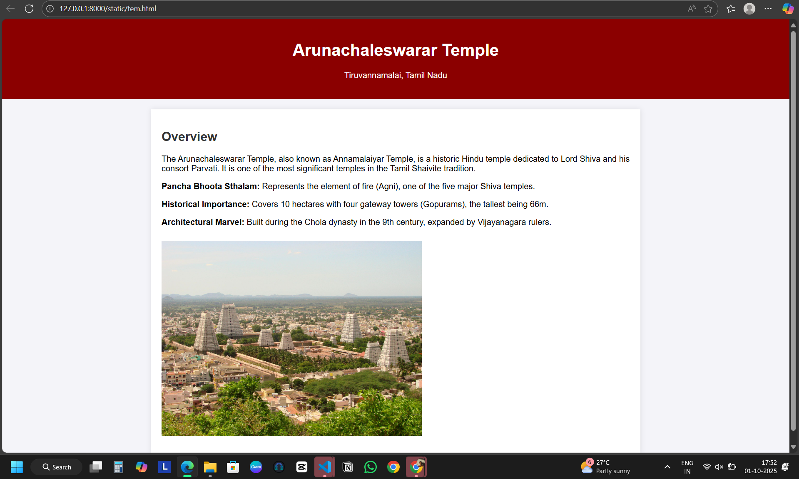

# Ex04 Places Around Me
## Date:01.10.2025

## AIM
To develop a website to display details about the places around my house.

## DESIGN STEPS

### STEP 1
Create a Django admin interface.

### STEP 2
Download your city map from Google.

### STEP 3
Using ```<map>``` tag name the map.

### STEP 4
Create clickable regions in the image using ```<area>``` tag.

### STEP 5
Write HTML programs for all the regions identified.

### STEP 6
Execute the programs and publish them.

## CODE
## map.html
```
<!DOCTYPE html>
<html lang="en">
<head>
  <meta charset="UTF-8">
  <meta name="viewport" content="width=device-width, initial-scale=1.0">
  <title>Tiruvannamalai Map with Hotspots</title>
  <style>
    body {
      font-family: Arial, sans-serif;
      background-color: #f9f9f9;
      text-align: center;
    }
    h1 {
      color: #2c3e50;
    }
    img {
      max-width: 90%;
      height: auto;
      border: 2px solid #444;
      border-radius: 8px;
    }
  </style>
</head>
<body>

  <h1>Tiruvannamalai Map with Hotspots</h1>
  <p>Click on the highlighted locations to explore them in Google Maps.</p>

  <!-- Map image -->
  

  <!-- Clickable areas -->
  <map name="tiruvannamalai-map">
    <!-- Imagica Fun World -->
    <area shape="circle" coords="730,120,40" 
          href="imagica.html" 
          alt="Imagica Fun World" target="_blank">

    <!-- Hotel Himalayaa -->
    <area shape="circle" coords="820,240,40" 
          href="hh.html" 
          alt="Hotel Himalayaa" target="_blank">

    <!-- Arunachaleswarar Temple -->
    <area shape="circle" coords="680,400,40" 
          href="tem.html" 
          alt="Arunachaleswarar Temple" target="_blank">

    <!-- The Mountain Retreat -->
    <area shape="circle" coords="280,420,45" 
          href="mountainretreat.html" 
          alt="The Mountain Retreat" target="_blank">
  </map>

</body>
</html>

```
## hh.html
```
<!DOCTYPE html>
<html lang="en">
<head>
    <meta charset="UTF-8">
    <meta name="viewport" content="width=device-width, initial-scale=1.0">
    <title>Hotel Himalayaa - Tiruvannamalai</title>
    <style>
        body {
            font-family: Arial, sans-serif;
            background-color: #f4f4f9;
            margin: 0;
            padding: 0;
        }
        header {
            background-color: #4CAF50;
            color: white;
            padding: 20px 0;
            text-align: center;
        }
        main {
            max-width: 900px;
            margin: 20px auto;
            padding: 20px;
            background-color: white;
            box-shadow: 0 0 10px rgba(0,0,0,0.1);
        }
        h2 {
            color: #333;
        }
        ul {
            list-style-type: square;
            margin-left: 20px;
        }
        a {
            color: #4CAF50;
            text-decoration: none;
        }
        a:hover {
            text-decoration: underline;
        }
        .contact-info p {
            margin: 5px 0;
        }
        .location iframe {
            height: 400px;
            border: 0;
            margin-top: 10px;
        }
    </style>
</head>
<body>
    <header>
        <h1>Hotel Himalayaa</h1>
        <p>Tiruvannamalai, Tamil Nadu</p>
    </header>
    <main>
        <section>
            <h2>Overview</h2>
            <p>Hotel Himalayaa is a well-known hotel located in Tiruvannamalai, approximately 2.5 km from the Arunachaleshwara Temple, making it a convenient choice for pilgrims and travelers.</p>
            <p><strong>Rating:</strong> 4.2/5</p>
        </section>

        <section>
            <h2>Facilities</h2>
            <ul>
                <li>Pure vegetarian restaurant offering South Indian and continental cuisines.</li>
                <li>Spacious rooms with amenities like air conditioning, minibar, LCD TV, and free Wi-Fi.</li>
                <li>Free self-parking and 24-hour front desk service.</li>
                <li>Proximity to local attractions such as Arunachaleshwara Temple and Yogi Ramsuratkumar Ashram.</li>
            </ul>
        </section>

        <section class="location">
           <iframe 
                src="hotel-himalayaa.jpg"
                allowfullscreen="" 
                width="500px"
                loading="lazy">
            </iframe>
        </section>
    </main>
</body>
</html>

```
## tem.html
```
<!DOCTYPE html>
<html lang="en">
<head>
    <meta charset="UTF-8">
    <meta name="viewport" content="width=device-width, initial-scale=1.0">
    <title>Arunachaleswarar Temple - Tiruvannamalai</title>
    <style>
        body {
            font-family: Arial, sans-serif;
            background-color: #f4f4f9;
            margin: 0;
            padding: 0;
        }
        header {
            background-color: #8B0000;
            color: white;
            padding: 20px 0;
            text-align: center;
        }
        main {
            max-width: 900px;
            margin: 20px auto;
            padding: 20px;
            background-color: white;
            box-shadow: 0 0 10px rgba(0,0,0,0.1);
        }
        h2 {
            color: #333;
        }
        ul {
            list-style-type: square;
            margin-left: 20px;
        }
        img {
            max-width: 100%;
            margin: 10px 0;
        }
        a {
            color: #8B0000;
            text-decoration: none;
        }
        a:hover {
            text-decoration: underline;
        }
    </style>
</head>
<body>
    <header>
        <h1>Arunachaleswarar Temple</h1>
        <p>Tiruvannamalai, Tamil Nadu</p>
    </header>
    <main>
        <section>
            <h2>Overview</h2>
            <p>The Arunachaleswarar Temple, also known as Annamalaiyar Temple, is a historic Hindu temple dedicated to Lord Shiva and his consort Parvati. It is one of the most significant temples in the Tamil Shaivite tradition.</p>
            <p><strong>Pancha Bhoota Sthalam:</strong> Represents the element of fire (Agni), one of the five major Shiva temples.</p>
            <p><strong>Historical Importance:</strong> Covers 10 hectares with four gateway towers (Gopurams), the tallest being 66m.</p>
            <p><strong>Architectural Marvel:</strong> Built during the Chola dynasty in the 9th century, expanded by Vijayanagara rulers.</p>
        </section>
        <section>
           
        </section>
    </main>
</body>
</html>

```
## mountainretreat.html
```
<!DOCTYPE html>
<html lang="en">
<head>
  <meta charset="UTF-8">
  <meta name="viewport" content="width=device-width, initial-scale=1.0">
  <title>The Mountain Retreat - Tiruvannamalai</title>
  <style>
    body {
      font-family: Arial, sans-serif;
      margin: 0;
      padding: 0;
      background-color: #f9f9f9;
      color: #333;
    }
    header {
      background: #6d4c41;
      color: white;
      text-align: center;
      padding: 20px;
    }
    section {
      max-width: 900px;
      margin: 20px auto;
      padding: 20px;
      background: white;
      border-radius: 8px;
      box-shadow: 0px 2px 6px rgba(0,0,0,0.2);
    }
    h2 {
      color: #6d4c41;
    }
    img {
      display: block;
      margin: 15px auto;
      max-width: 90%;
      border-radius: 10px;
      border: 2px solid #ccc;
    }
    .map-link {
      display: inline-block;
      margin-top: 15px;
      padding: 10px 15px;
      background: #8d6e63;
      color: white;
      text-decoration: none;
      border-radius: 6px;
    }
    .map-link:hover {
      background: #5d4037;
    }
  </style>
</head>
<body>

  <header>
    <h1>The Mountain Retreat - Tiruvannamalai</h1>
  </header>

  <section>
    <h2>About The Mountain Retreat</h2>
    <p>
      <b>The Mountain Retreat</b> is a peaceful getaway spot near 
      Tiruvannamalai, located close to the sacred Arunachala Hills. 
      It offers a calm and serene environment for visitors who wish 
      to relax, meditate, and enjoy nature away from the busy town. 
      With scenic views, natural surroundings, and comfortable stay 
      options, it is popular among tourists and spiritual seekers.
    </p>

    

    <h2>Location</h2>
    <p>
      The Mountain Retreat is located near the <b>179B road</b, 
      close to the western side of Annamalaiyar Hill. It is a 
      short drive from Tiruvannamalai town and easily reachable 
      by local transport.
    </p>

    <a class="map-link" 
       href="https://goo.gl/maps/RLPqZsYFQKox7WxM6" 
       target="_blank">
       📍 View on Google Maps
    </a>
  </section>

</body>
</html>

```
## imagica.html
```
<!DOCTYPE html>
<html lang="en">
<head>
  <meta charset="UTF-8">
  <meta name="viewport" content="width=device-width, initial-scale=1.0">
  <title>Imagica Fun World - Tiruvannamalai</title>
  <style>
    body {
      font-family: Arial, sans-serif;
      margin: 0;
      padding: 0;
      background-color: #f9f9f9;
      color: #333;
    }
    header {
      background: #2c3e50;
      color: white;
      text-align: center;
      padding: 20px;
    }
    section {
      max-width: 900px;
      margin: 20px auto;
      padding: 20px;
      background: white;
      border-radius: 8px;
      box-shadow: 0px 2px 6px rgba(0,0,0,0.2);
    }
    h2 {
      color: #2c3e50;
    }
    img {
      display: block;
      margin: 15px auto;
      max-width: 90%;
      border-radius: 10px;
      border: 2px solid #ccc;
    }
    .map-link {
      display: inline-block;
      margin-top: 15px;
      padding: 10px 15px;
      background: #27ae60;
      color: white;
      text-decoration: none;
      border-radius: 6px;
    }
    .map-link:hover {
      background: #219150;
    }
  </style>
</head>
<body>

  <header>
    <h1>Imagica Fun World - Tiruvannamalai</h1>
  </header>

  <section>
    <h2>About Imagica Fun World</h2>
    <p>
      <b>Imagica Fun World</b> is one of the popular amusement spots in 
      Tiruvannamalai. It offers fun rides, games, and recreational activities 
      for families and children. Located near Vengikkal, this place is often 
      visited by locals and tourists looking for entertainment alongside 
      their spiritual trips to the Arunachaleswarar Temple.
    </p>

    

    <h2>Location</h2>
    <p>
      Imagica Fun World is located in <b>Vengikkal, Tiruvannamalai</b>, just a few 
      kilometers away from the main town. It is easily accessible from 
      Tiruvannamalai bus stand and other local landmarks.
    </p>

    
  </section>

</body>
</html>

```
## OUTPUT






## RESULT
The program for implementing image maps using HTML is executed successfully.
